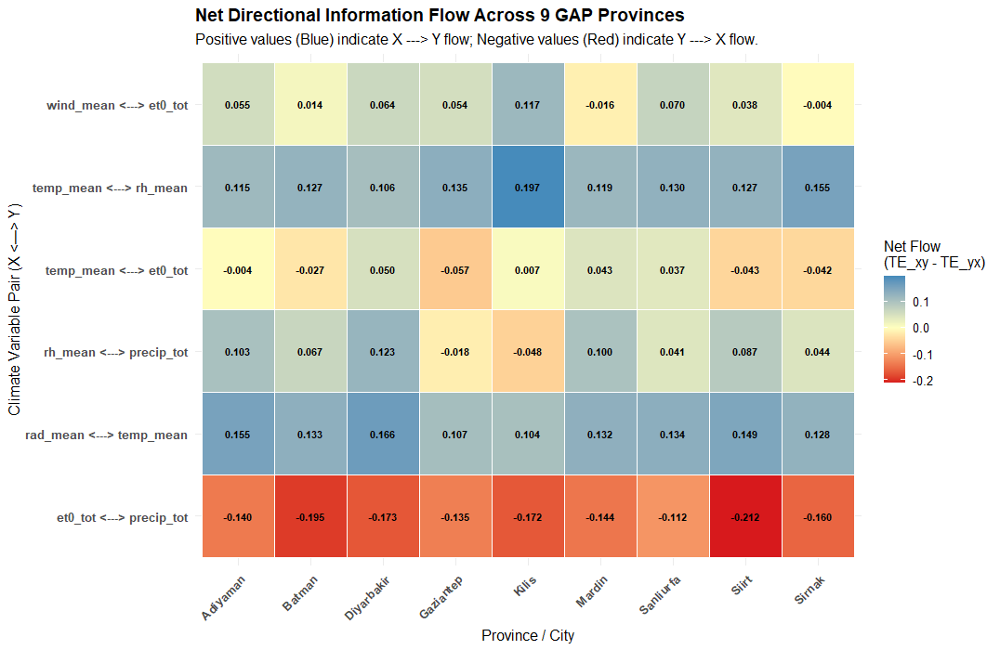
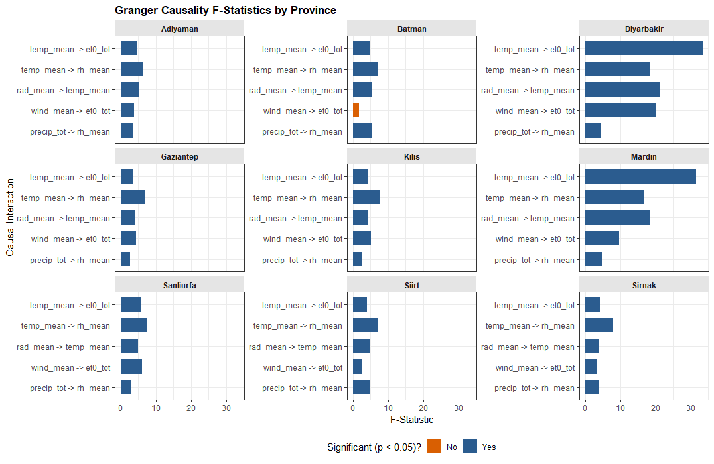
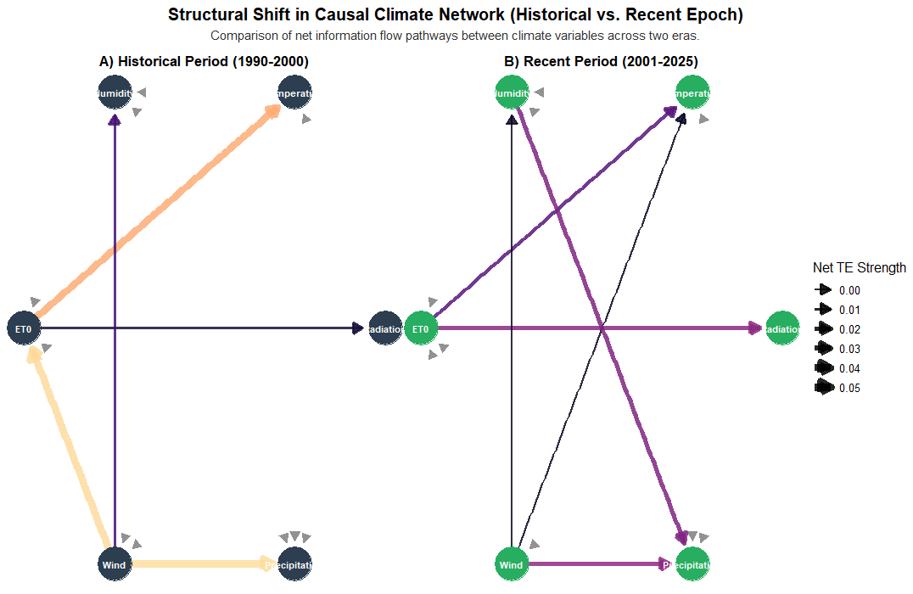
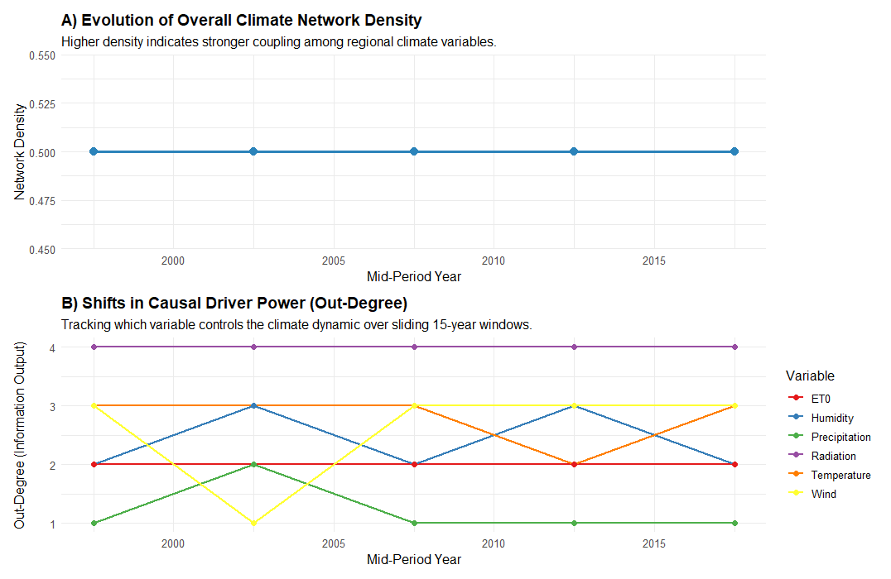
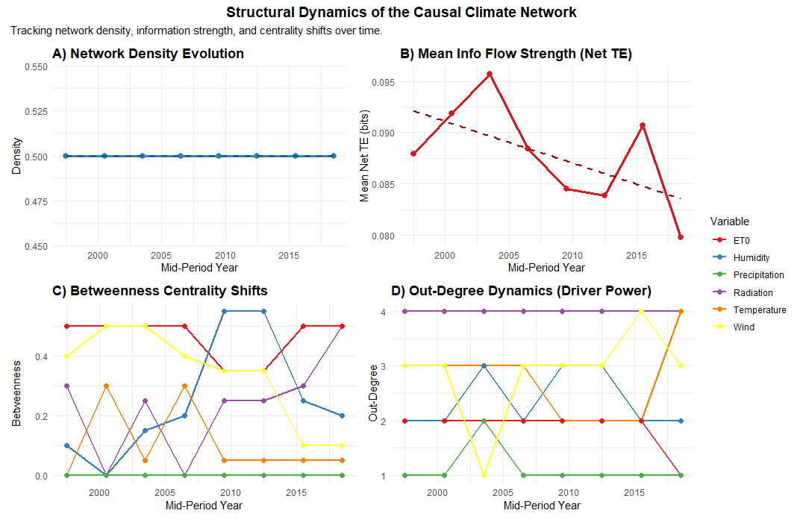
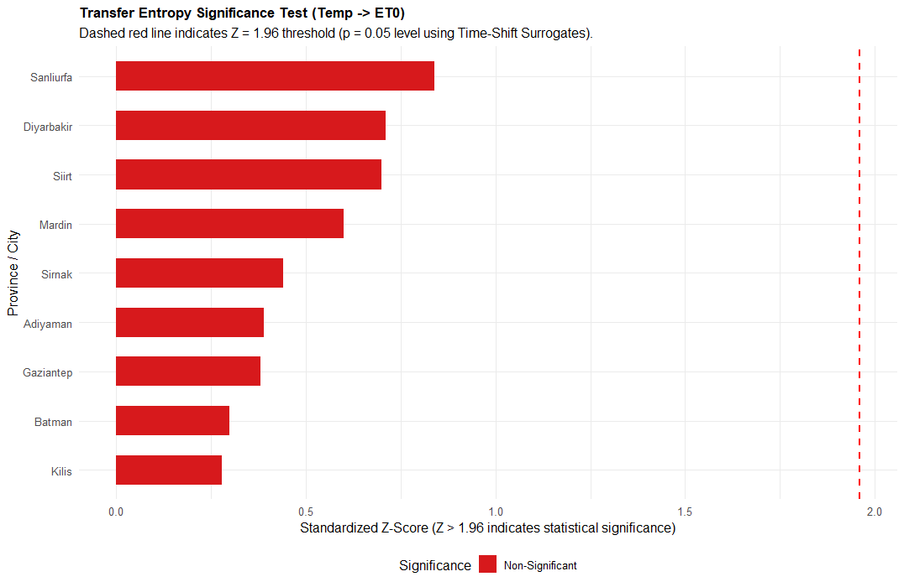
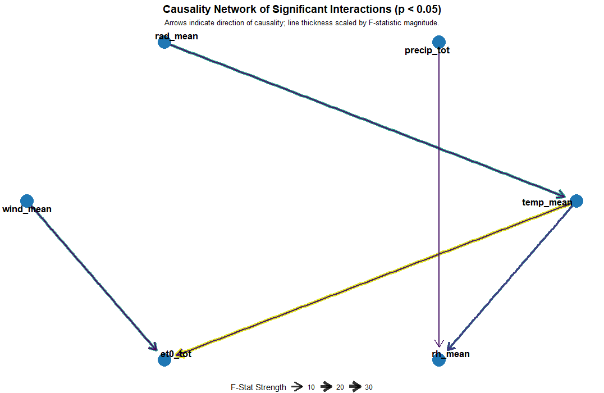
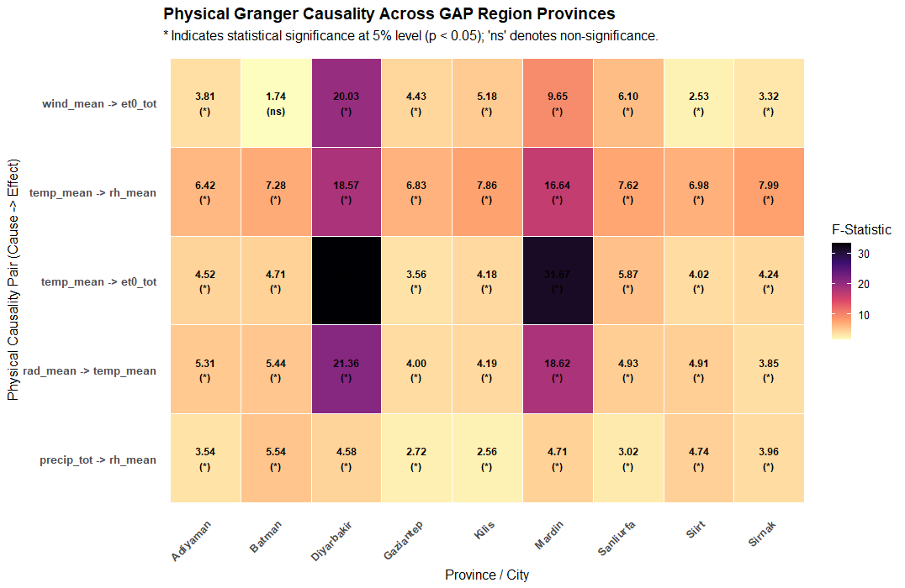

# Changing Causal Structure of the Climate System in Southeastern Türkiye

### A Transfer Entropy, Granger Causality and Climate Network Approach

[](https://power.larc.nasa.gov/)
[](#data-and-study-period)
[](#methodological-framework)
[](#causal-climate-network)

---

## Research Focus

Climate change is not expressed only through long-term changes in individual climate variables. It may also modify the **direction, strength and organization of interactions among climate variables**.

This project investigates whether the **causal structure of the climate system in Southeastern Türkiye changed during 1981–2025**.

Rather than analysing temperature, precipitation, humidity, wind, solar radiation and evapotranspiration independently, the study conceptualizes the regional climate system as a **directed information-transfer network**.

### Main Research Question

> **Has the structure of information transfer among climate variables changed over time in Southeastern Türkiye?**

The analytical framework combines:

- Transfer Entropy
- Granger Causality
- Climate Network Analysis
- Network Centrality
- Temporal Network Analysis
- Structural Shift Analysis

---

# Key Results

## Main Network Structure

The detected causal climate network contains:

| Network characteristic | Result |
|---|---:|
| Climate variables | **6** |
| Directed causal connections | **15** |
| Network density | **0.50** |
| Global efficiency | **9.8089** |

The results indicate that the regional climate system is characterized by a relatively dense network of directional information-transfer pathways.

Most importantly, the network structure is **not temporally invariant**.

---

# Principal Structural Changes

| Causal pathway | Historical TE | Recent TE | Change | Interpretation |
|---|---:|---:|---:|---|
| Temperature → Wind | 0.0954 | 0.0000 | **−0.0954** | Vanishing |
| Temperature → Precipitation | 0.1876 | 0.1292 | **−0.0584** | Weakened |
| Precipitation → ET0 | 0.1436 | 0.2000 | **+0.0564** | Strengthened |
| Humidity → Precipitation | 0.0666 | 0.0184 | **−0.0482** | Weakened |
| Radiation → Temperature | 0.1214 | 0.1557 | **+0.0343** | Strengthened |
| ET0 → Temperature | 0.0415 | 0.0137 | **−0.0278** | Weakened |
| Humidity → ET0 | 0.0975 | 0.1167 | **+0.0191** | Strengthened |
| ET0 → Radiation | 0.0052 | 0.0198 | **+0.0146** | Strengthened |
| Wind → ET0 | 0.0463 | 0.0607 | **+0.0145** | Strengthened |
| Radiation → Precipitation | 0.1315 | 0.1460 | **+0.0145** | Strengthened |

### Most Important Findings

**1. Temperature → Wind**

The strongest structural decline occurs in the **Temperature → Wind** pathway.

Transfer Entropy decreases from:

**0.0954 → 0.0000**

indicating that this pathway is no longer detected in the recent network configuration.

**2. Precipitation → ET0**

The strongest increase occurs in:

**Precipitation → ET0**

with Transfer Entropy increasing from:

**0.1436 → 0.2000**

This represents a substantial strengthening of the precipitation–evapotranspiration information pathway.

**3. Radiation → Temperature**

The pathway strengthens from:

**0.1214 → 0.1557**

indicating an increased role of radiation in the recent temperature-related causal structure.

**4. Humidity → ET0**

The pathway increases from:

**0.0975 → 0.1167**

suggesting a strengthening relationship between atmospheric moisture conditions and evaporative demand.

**5. Wind → Temperature**

A previously absent pathway emerges:

**0.0000 → 0.0029**

This represents an emerging directional relationship in the recent network.

---

# Results at a Glance

## Causal Information-Transfer Changes



---

## Causal Climate Network



The network represents directional information transfer among the six climate variables.

---

## Network Structural Metrics



The network metrics provide a system-level representation of the changing organization of climate interactions.

---

## Temporal Network Evolution



The temporal analysis demonstrates that network structure can reorganize even when overall network density remains relatively stable.

---

## Transfer Entropy Structure



Transfer Entropy quantifies directional information transfer between climate variables.

---

## Granger Causality Results



Granger causality provides a complementary statistical assessment of directional temporal dependence.

---

## Additional Network Analysis



---

## Additional Structural Analysis



---

# Regional Climate Variability

## Regional Temperature Variability


The regional temperature series provides the climatic background for interpreting the evolution of the causal network.

---

## Temperature Evolution Across Nine Provinces


The nine-province comparison demonstrates spatial differences and common temporal behaviour across Southeastern Türkiye.

---

# Province-Level Climate Variability

The following figures present the temporal behaviour of the principal climate variables for all nine provinces included in the regional analysis.

---

## Adıyaman


---

## Batman


---

## Diyarbakır


---

## Gaziantep


---

## Kilis


---

## Mardin


---

## Şanlıurfa


---

## Siirt


---

## Şırnak


---

# Causal Climate Network

The central component of the study is a directed climate network representing information-transfer pathways among:

- Temperature
- Precipitation
- Relative Humidity
- Wind Speed
- Solar Radiation
- Reference Evapotranspiration

The detected network contains:

**6 nodes + 15 directed edges**

with:

**Network density = 0.50**

This indicates that a substantial proportion of theoretically possible directional relationships are represented in the detected causal structure.

---

# Temporal Network Evolution

A moving-window approach was used to investigate whether the network remained structurally stable through time.

| Temporal Window | Network Density | Dominant Structural Feature |
|---|---:|---|
| 1990–2004 | 0.50 | Radiation shows high outgoing connectivity |
| 1995–2009 | 0.50 | Humidity and Wind gain importance |
| 2000–2014 | 0.50 | Temperature and Wind become more prominent |
| 2005–2019 | 0.50 | Humidity becomes highly central |
| 2010–2024 | 0.50 | Radiation again shows strong outgoing connectivity |

Although the global density remains **0.50**, the distribution of centrality and directional information flow changes across temporal windows.

Therefore:

> **A stable network density does not necessarily imply a stable climate-system structure.**

The identity and importance of the central variables may change while the total number of connections remains similar.

---

# Strengthened Information Pathways

The following pathways become stronger in the recent period:

- **Precipitation → ET0**
- **Radiation → Temperature**
- **Humidity → ET0**
- **ET0 → Radiation**
- **Wind → ET0**
- **Radiation → Precipitation**
- **Radiation → Humidity**

The most pronounced strengthening occurs in:

### Precipitation → ET0

**Historical TE:** 0.1436  
**Recent TE:** 0.2000

This indicates a substantial increase in the directional information transfer from precipitation toward reference evapotranspiration.

---

# Weakened Information Pathways

Several historically detected pathways become weaker:

- Temperature → Wind
- Temperature → Precipitation
- Humidity → Precipitation
- ET0 → Temperature
- Wind → Precipitation
- Wind → Humidity
- Radiation → Wind
- Temperature → Humidity

The strongest decline is observed in:

### Temperature → Wind

**Historical TE:** 0.0954  
**Recent TE:** 0.0000

---

# Emerging Information Pathway

A new directional pathway is detected:

### Wind → Temperature

**Historical TE:** 0.0000  
**Recent TE:** 0.0029

Although the magnitude is relatively small, its appearance illustrates that the **directionality of interactions can change through time**.

---

# Interpretation of the Causal Structure

The results indicate that climate change may involve more than monotonic changes in individual variables.

The regional climate system appears to undergo changes in:

- information-transfer intensity,
- causal direction,
- network centrality,
- interaction structure,
- and temporal organization.

Radiation remains an important source of outgoing connectivity, while precipitation and evapotranspiration become increasingly important in the recent configuration.

The strengthening of:

**Radiation → Temperature**

**Precipitation → ET0**

and

**Humidity → ET0**

suggests an increasing importance of energy availability, precipitation and atmospheric moisture conditions in the recent climate-system structure.

At the same time, the weakening of:

**Temperature → Precipitation**

and

**Humidity → Precipitation**

shows that historically important relationships are not necessarily temporally stable.

---

# Methodological Framework

```text
NASA POWER Monthly Climate Data
              │
              ▼
      Data Quality Control
              │
              ▼
      Monthly Climate Series
              │
              ▼
 Stationarity & Preprocessing
              │
       ┌──────┴──────┐
       ▼             ▼
 Granger          Transfer
 Causality        Entropy
       │             │
       └──────┬──────┘
              ▼
      Causal Climate Network
              │
              ▼
       Network Metrics
              │
              ▼
      Temporal Network
          Evolution
              │
              ▼
 Historical vs. Recent
 Structural Comparison
              │
              ▼
 Climate-System
 Reorganization
# Data and Study Period

Monthly climate data were obtained from the **NASA POWER** database for nine provinces of Southeastern Türkiye.

- **Study period:** 1981–2025
- **Temporal resolution:** Monthly
- **Spatial coverage:** Adıyaman, Batman, Diyarbakır, Gaziantep, Kilis, Mardin, Şanlıurfa, Siirt and Şırnak

### Climate Variables

| Variable | Description |
|---|---|
| T2M | Air Temperature |
| PRECTOTCORR | Corrected Precipitation |
| RH2M | Relative Humidity |
| WS2M | Wind Speed |
| ALLSKY_SFC_SW_DWN | Solar Radiation |
| ET0 | Reference Evapotranspiration |

---

# Methodological Framework

The analysis combines **Transfer Entropy, Granger Causality and Climate Network Analysis** to investigate directional information transfer among climate variables.

```text
NASA POWER Data
      ↓
Data Preprocessing
      ↓
Stationarity Analysis
      ↓
Granger Causality
      ↓
Transfer Entropy
      ↓
Causal Climate Network
      ↓
Temporal Network Analysis
      ↓
Structural Change Detection
