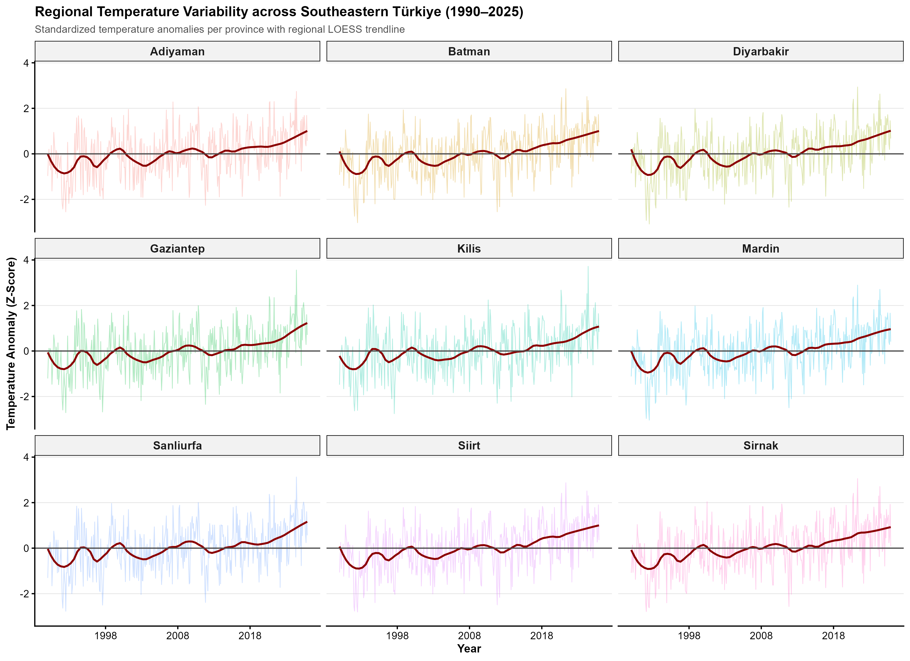
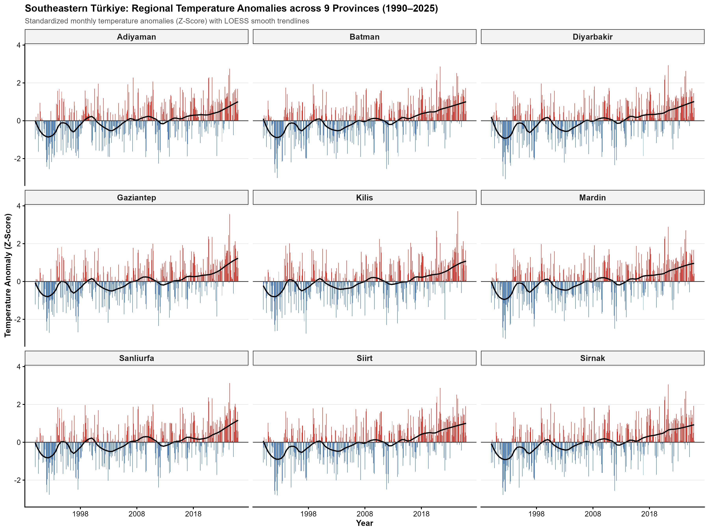
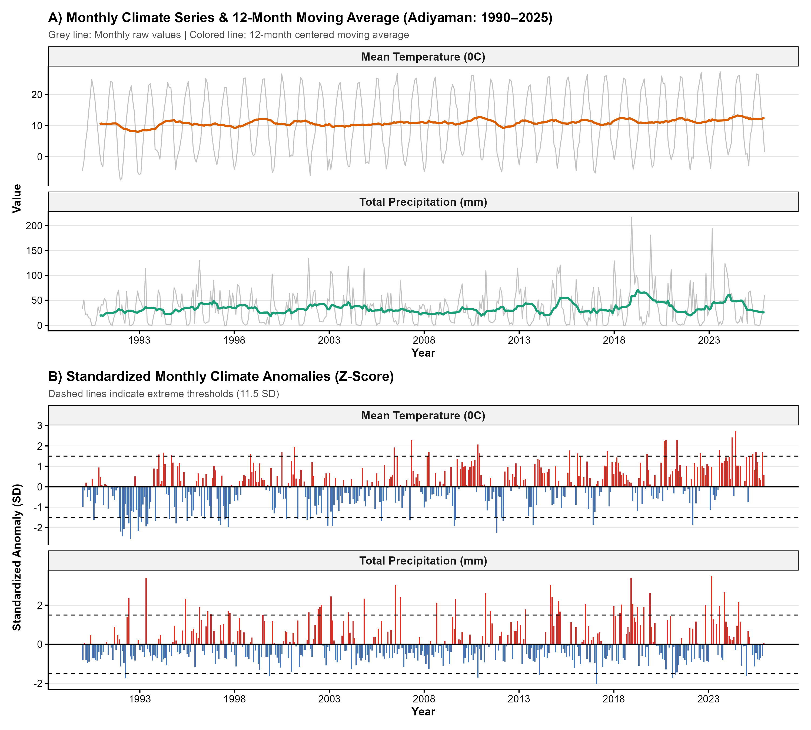
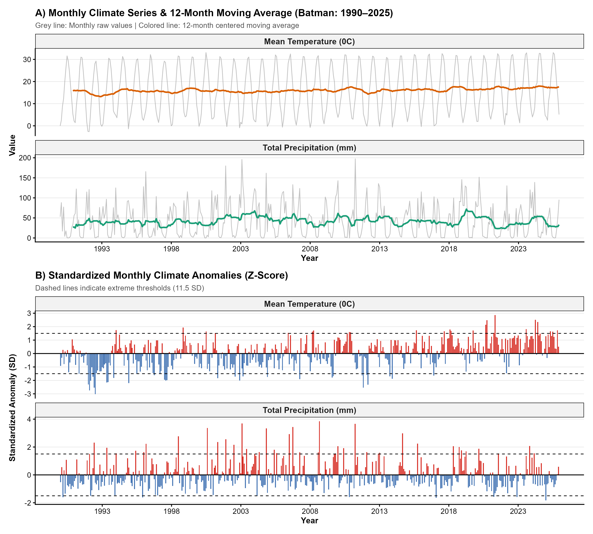
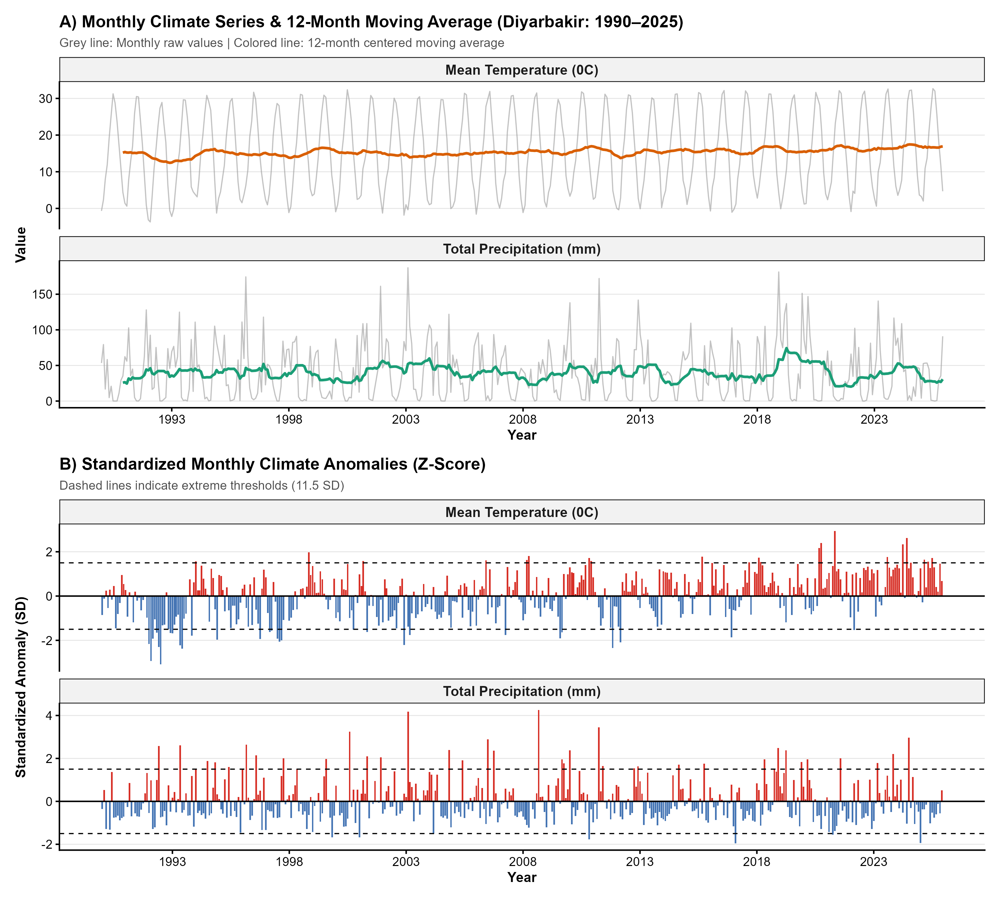
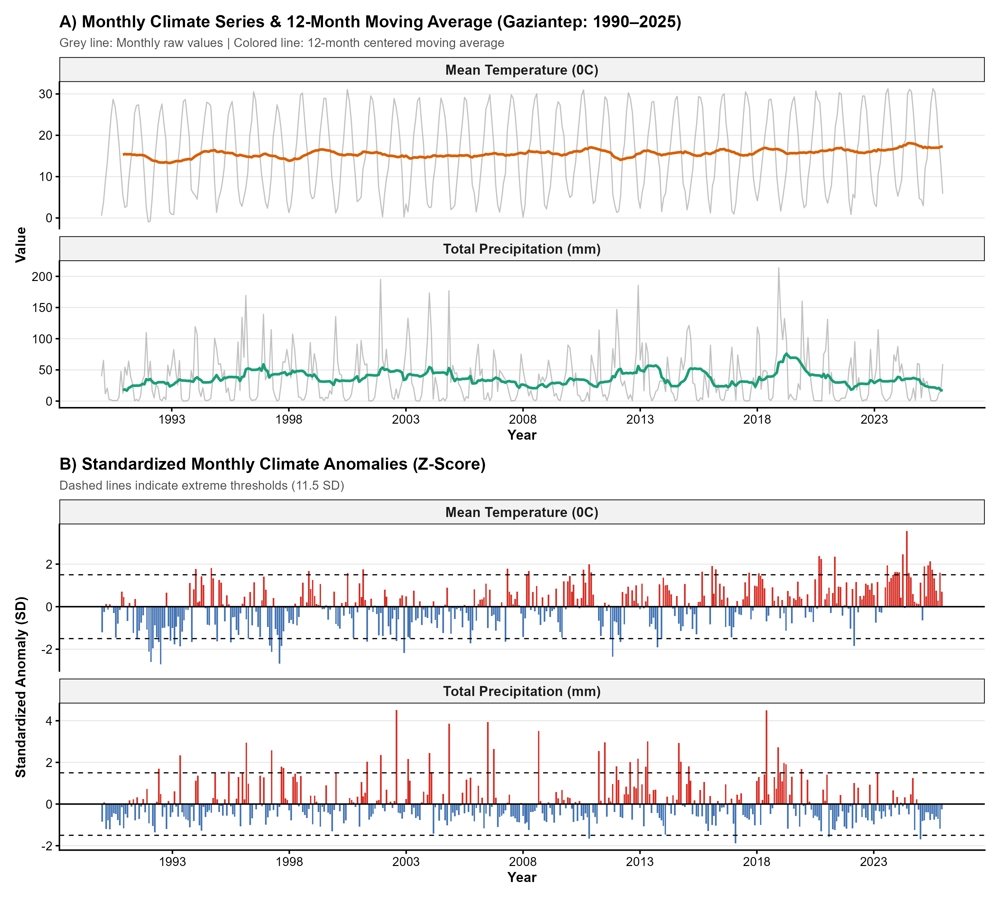
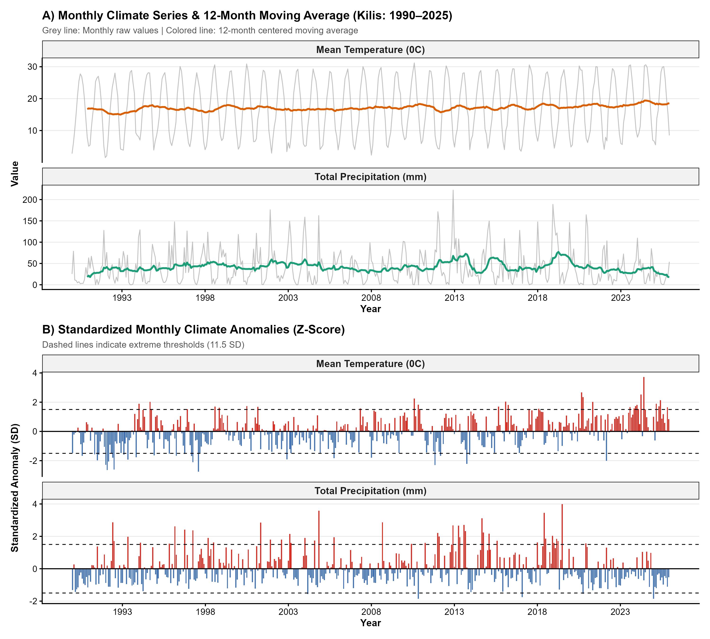
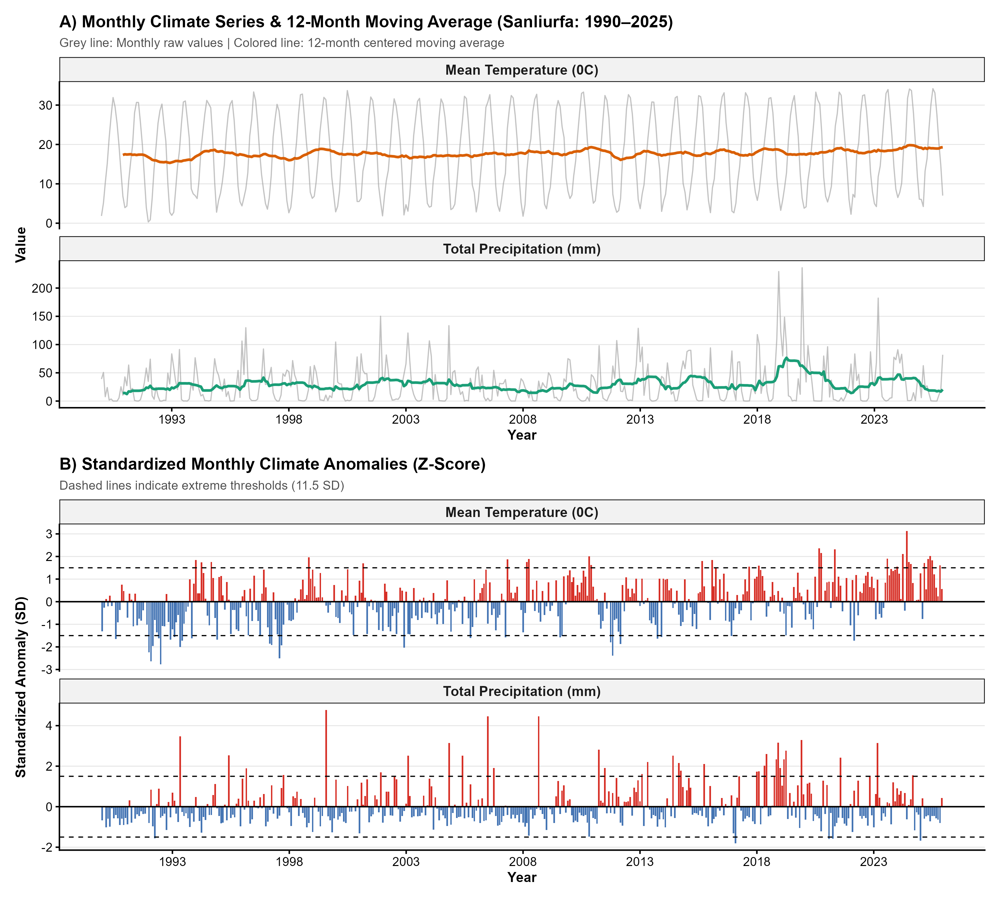
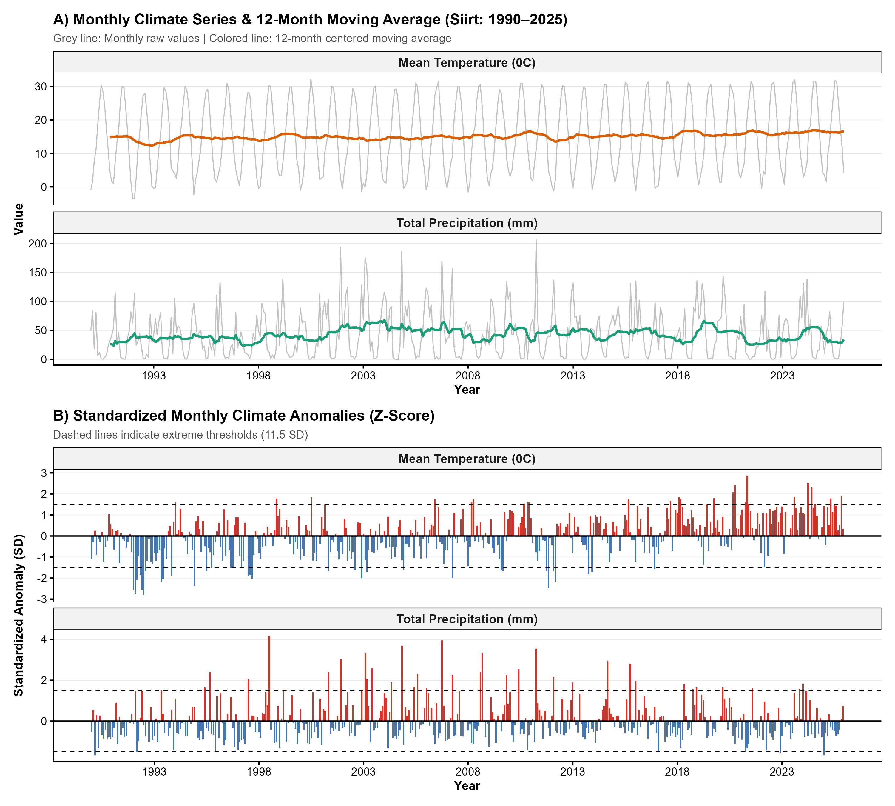
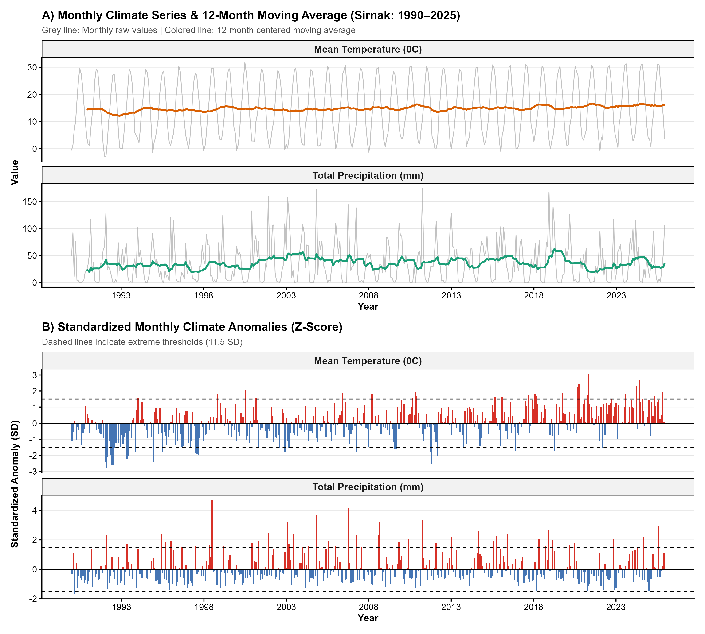

# Changing Causal Structure of the Climate System in Southeastern Türkiye

### A Transfer Entropy and Climate Network Approach

[](https://power.larc.nasa.gov/)
[](#data-and-study-period)
[](#methodological-framework)
[](#causal-climate-network)

---

## Research Focus

Climate change is not expressed only through changes in the mean or trend of individual climate variables. It may also alter the **interactions, dependencies, directionality and information-transfer pathways** that organize a regional climate system.

This project investigates whether the **causal structure of the climate system in Southeastern Türkiye changed during 1981–2025**.

Instead of analysing temperature, precipitation, humidity, wind, radiation and evapotranspiration independently, the study represents the regional climate system as a **directed information network**.

### Main Research Question

> **Has the structure of information transfer among climate variables changed over time in Southeastern Türkiye?**

The analysis combines **Transfer Entropy, Granger Causality and temporal climate-network analysis** to identify changing causal relationships and structural reorganization within the regional climate system.

---

# Key Results

The current analysis identifies a six-variable causal climate network consisting of:

* **6 climate variables**
* **15 directed causal connections**
* **Network density: 0.50**
* **Global efficiency: 9.8089**

The structural comparison indicates that the causal architecture is **not completely stationary through time**.

### Major Structural Changes

| Causal pathway              | Historical TE | Recent TE |  Change | Interpretation |
| --------------------------- | ------------: | --------: | ------: | -------------- |
| Temperature → Wind          |        0.0954 |    0.0000 | −0.0954 | Vanishing      |
| Temperature → Precipitation |        0.1876 |    0.1292 | −0.0584 | Weakened       |
| Precipitation → ET0         |        0.1436 |    0.2000 | +0.0564 | Amplified      |
| Humidity → Precipitation    |        0.0666 |    0.0184 | −0.0482 | Weakened       |
| Radiation → Temperature     |        0.1214 |    0.1557 | +0.0343 | Amplified      |
| ET0 → Temperature           |        0.0415 |    0.0137 | −0.0278 | Weakened       |
| Humidity → ET0              |        0.0975 |    0.1167 | +0.0191 | Amplified      |
| ET0 → Radiation             |        0.0052 |    0.0198 | +0.0146 | Amplified      |
| Wind → ET0                  |        0.0463 |    0.0607 | +0.0145 | Amplified      |
| Radiation → Precipitation   |        0.1315 |    0.1460 | +0.0145 | Amplified      |

The strongest detected reduction occurs in the **Temperature → Wind** pathway, which disappears in the recent period. In contrast, the **Precipitation → ET0** pathway becomes substantially stronger.

These results indicate a reorganization of the information-transfer structure rather than a simple uniform strengthening or weakening of all climate relationships.

---

# Main Results and Visual Evidence

## Regional Climate Variability

### Regional Temperature Variability



The regional temperature series provides the broad climatic background against which changes in the causal network are interpreted.

### Temperature Evolution Across the Nine Provinces



The nine-province comparison demonstrates the spatial consistency and variability of temperature behaviour across Southeastern Türkiye.

---

# Province-Level Climate Variability

The following figures present the temporal behaviour of the principal climate variables for each province included in the regional analysis.

## Adıyaman



## Batman



## Diyarbakır



## Gaziantep



## Kilis



## Mardin


## Şanlıurfa



## Siirt



## Şırnak



---

# Causal Climate Network

The central analytical component of the project is a directed climate network representing statistically supported information-transfer pathways among six climate variables:

```text
                    Solar Radiation
                     /     |      \
                    ↓      ↓       ↓
             Temperature → Precipitation
                 ↑  ↓          ↓
                 |  |          ↓
               Wind ───────→  ET0
                 ↑             ↑
                 └── Humidity ─┘
```

The network contains **6 nodes and 15 directed edges**, corresponding to a network density of **0.50**.

This structure demonstrates that the regional climate system behaves as an interconnected system rather than as a collection of independent variables.

---

# Temporal Network Evolution

A moving-window framework was used to examine whether network characteristics remained stable during the study period.

| Temporal Window | Network Density | Main Structural Feature                         |
| --------------- | --------------: | ----------------------------------------------- |
| 1990–2004       |            0.50 | Radiation shows high outgoing connectivity      |
| 1995–2009       |            0.50 | Humidity and Wind gain structural importance    |
| 2000–2014       |            0.50 | Temperature and Wind become more prominent      |
| 2005–2019       |            0.50 | Humidity becomes highly central                 |
| 2010–2024       |            0.50 | Radiation again dominates outgoing connectivity |

Although overall network density remains constant at **0.50**, the distribution of centrality and outgoing connectivity among variables changes across temporal windows.

This distinction is important: **structural reorganization can occur even when global network density remains unchanged.**

---

# Information-Transfer Reorganization

The most important finding is not simply whether a connection exists, but **how the strength and direction of information transfer change between periods**.

### Strengthened Pathways

Several causal pathways show increased Transfer Entropy in the recent period:

* **Precipitation → ET0**
* **Radiation → Temperature**
* **Humidity → ET0**
* **ET0 → Radiation**
* **Wind → ET0**
* **Radiation → Precipitation**
* **Radiation → Humidity**

Among these, the strongest increase occurs for:

> **Precipitation → ET0**

with Transfer Entropy increasing from approximately **0.1436 to 0.2000**.

### Weakened Pathways

Several pathways decline:

* **Temperature → Wind**
* **Temperature → Precipitation**
* **Humidity → Precipitation**
* **ET0 → Temperature**
* **Wind → Precipitation**
* **Wind → Humidity**
* **Radiation → Wind**
* **Temperature → Humidity**

The **Temperature → Wind** pathway exhibits the strongest decline and becomes absent in the recent period.

### Emerging Pathway

An additional pathway appears in the recent period:

> **Wind → Temperature**

with Transfer Entropy increasing from approximately **0.0000 to 0.0029**.

This represents an **emerging causal connection** in the recent network structure.

---

# Methodological Framework

The analytical workflow follows a reproducible climate-network framework:

```text
NASA POWER Monthly Climate Data
              │
              ▼
      Data Quality Control
              │
              ▼
      Monthly Climate Series
              │
              ▼
 Stationarity & Preprocessing
              │
       ┌──────┴──────┐
       ▼             ▼
 Granger          Transfer
 Causality        Entropy
       │             │
       └──────┬──────┘
              ▼
      Causal Climate Network
              │
              ▼
     Network Metrics
              │
              ▼
      Temporal Network
         Evolution
              │
              ▼
 Historical vs. Recent
 Structural Comparison
              │
              ▼
 Climate-System
 Reorganization
```

---

# Data and Study Period

## Data Source

Monthly climate data were obtained from the **NASA POWER** project.

### Temporal Coverage

**1981–2025**

### Temporal Resolution

**Monthly**

### Climate Variables

| Variable          | Description                  |
| ----------------- | ---------------------------- |
| T2M               | Air Temperature              |
| PRECTOTCORR       | Corrected Precipitation      |
| RH2M              | Relative Humidity            |
| WS2M              | Wind Speed                   |
| ALLSKY_SFC_SW_DWN | Solar Radiation              |
| ET0               | Reference Evapotranspiration |

---

# Analytical Methods

## 1. Data Preprocessing

The climate series were processed to ensure:

* temporal consistency,
* numerical consistency,
* missing-value control,
* stationarity assessment,
* comparable temporal resolution.

## 2. Granger Causality

Granger causality was used to examine whether the historical information contained in one climate variable improves the prediction of another variable.

The approach provides a complementary statistical framework for identifying directional temporal dependencies.

## 3. Transfer Entropy

Transfer Entropy was used as the principal information-theoretic measure of directional information transfer.

Unlike conventional correlation analysis, Transfer Entropy can identify **directional and potentially nonlinear information flow**.

The general interpretation is:

```text
X → Y
```

meaning that information contained in the historical state of **X** contributes to the uncertainty reduction of **Y**, beyond the information already contained in Y's own history.

## 4. Causal Climate Network

Significant directional relationships were transformed into a directed network.

### Nodes

Climate variables.

### Edges

Directional information-transfer pathways.

### Network Metrics

The analysis includes:

* Network Density
* Global Efficiency
* Out-Degree
* Betweenness Centrality
* Temporal Network Structure
* Transfer Entropy Magnitude
* Structural Change

---

# Why This Approach?

Traditional climate-change studies frequently focus on:

* linear trends,
* averages,
* anomalies,
* correlations,
* individual climate variables.

This project takes a different perspective.

Instead of asking:

> **“Is temperature increasing?”**

the analysis asks:

> **“Is the internal organization of the climate system changing?”**

This distinction allows climate change to be investigated as a **system-level reorganization of interactions and information flows**.

---

# Interpretation of the Network

The results suggest that the climate system of Southeastern Türkiye exhibits a relatively dense causal architecture, with **half of the theoretically possible directed relationships represented in the detected network**.

Radiation emerges as an important driver, maintaining high outgoing connectivity across the temporal windows. Precipitation and evapotranspiration also become increasingly important in the recent structural configuration.

The strengthening of pathways involving **Radiation → Temperature**, **Precipitation → ET0**, and **Humidity → ET0** suggests increasing importance of energy availability, moisture conditions and atmospheric water demand within the recent causal configuration.

At the same time, weakening pathways such as **Temperature → Precipitation** and **Humidity → Precipitation** indicate that some historically prominent relationships have become less pronounced.

The disappearance of **Temperature → Wind** and emergence of **Wind → Temperature** further demonstrate that the directionality of climate interactions may change through time.

---

# Main Scientific Interpretation

The analysis supports the interpretation that:

> **Climate change in Southeastern Türkiye may involve not only changes in individual climate variables, but also a reorganization of the relationships through which information is transferred within the regional climate system.**

This provides a complementary perspective to conventional trend-based climate analysis.

The findings should therefore be interpreted as evidence of **changing temporal information-transfer structure**, rather than as proof of deterministic physical causation.

---

# Repository Structure

```text
Changing-Causal-Structure-of-the-Climate-System-in-Southeastern-Türkiye/
│
├── 1.R
├── 2.R
├── 3.R
├── 4.R
├── 5.R
├── 6.R
├── 7.R
├── 8.R
├── 9.R
├── 10.R
├── 11.R
├── 12.R
├── 13.R
├── 14.R
│
├── GAP_Stationary_Climate_Series_1990_2025.csv
│
├── Table_Causal_Network_Global_Metrics_EN.csv
├── Table_Causal_Network_Node_Metrics_EN.csv
├── Table_Causal_Network_Structural_Shift.csv
├── Table_Granger_Physical_9Provinces.csv
├── Table_Post_Stationarity_Check.csv
├── Table_Temporal_Network_Metrics_Evolution.csv
├── Table_Transfer_Entropy_9Provinces_EN.csv
├── Table_Transfer_Entropy_Surrogate_Significance_9Provinces.csv
│
├── Figure2_Regional_Temperature_Variability.png
├── Figure_Regional_9Provinces_Temperature.png
│
├── Figure_Climate_Variability_Adiyaman.png
├── Figure_Climate_Variability_Batman.png
├── Figure_Climate_Variability_Diyarbakir.png
├── Figure_Climate_Variability_Gaziantep.png
├── Figure_Climate_Variability_Kilis.png
├── Figure_Climate_Variability_Mardin.png
├── Figure_Climate_Variability_Sanliurfa.png
├── Figure_Climate_Variability_Siirt.png
├── Figure_Climate_Variability_Sirnak.png
│
└── README.md
```

---

# Reproducibility

All analyses are implemented using **R** and are organized as sequential scripts.

The repository provides:

* raw/processed climate series,
* statistical outputs,
* Transfer Entropy results,
* Granger causality results,
* network metrics,
* structural-shift tables,
* temporal-network metrics,
* publication-oriented figures.

The workflow is designed to facilitate **reproducibility, methodological transparency and further extension**.

---

# Scientific Contribution

The main contribution of this project is the integration of:

**Climate Change + Information Theory + Causal Inference + Complex Networks + Temporal Analysis**

within a regional climate-system framework.

Rather than treating climate variables as isolated time series, the project investigates the **architecture of interactions among climate variables and its temporal reorganization**.

This framework can potentially be extended to:

* drought dynamics,
* heatwave systems,
* compound climate extremes,
* atmospheric moisture transport,
* hydroclimatic networks,
* climate-risk assessment,
* regional climate adaptation studies.

---

# Limitations

The results should be interpreted within the methodological assumptions of Granger causality and Transfer Entropy.

In particular:

* statistical causality does not necessarily imply direct physical causation;
* Transfer Entropy estimates depend on preprocessing and parameter choices;
* NASA POWER represents a gridded/reanalysis-based climate data source rather than direct station observations;
* network structure may depend on the selected temporal windows and significance criteria.

These limitations do not invalidate the network approach, but they define the appropriate scope of inference.

---

# Conclusion

This project demonstrates a **network-based approach to regional climate-change analysis in Southeastern Türkiye**.

The results indicate that the climate system contains a structured network of directional information-transfer pathways and that several of these pathways have changed in strength or status between historical and recent periods.

The most pronounced changes include:

* disappearance of **Temperature → Wind**;
* weakening of **Temperature → Precipitation**;
* strengthening of **Precipitation → ET0**;
* strengthening of **Radiation → Temperature**;
* strengthening of **Humidity → ET0**;
* emergence of **Wind → Temperature**.

The central conclusion is therefore:

> **The regional climate system is not only changing in its individual variables; its internal causal-information architecture is also undergoing measurable reorganization.**

---

## Keywords

`Climate Change` · `Southeastern Türkiye` · `NASA POWER` · `Transfer Entropy` · `Granger Causality` · `Causal Network` · `Climate Network` · `Information Flow` · `Complex Systems` · `Temporal Network Analysis` · `Climate Variability` · `Evapotranspiration`

---

## Author

**Ahmet Solmaz**

Geography | Climate Change | Environmental Analysis | Climate Networks | Statistical Modelling

**Research interests:**
Climate dynamics, hydroclimatology, climate variability, climate-network analysis, environmental change and quantitative geography.

---

## Citation

If you use this repository or its methodological framework in academic work, please cite the repository and acknowledge the use of NASA POWER climate data.

---

## License

This repository is intended for **academic and research purposes**. Please acknowledge the original data sources and methodology when reusing the material.
